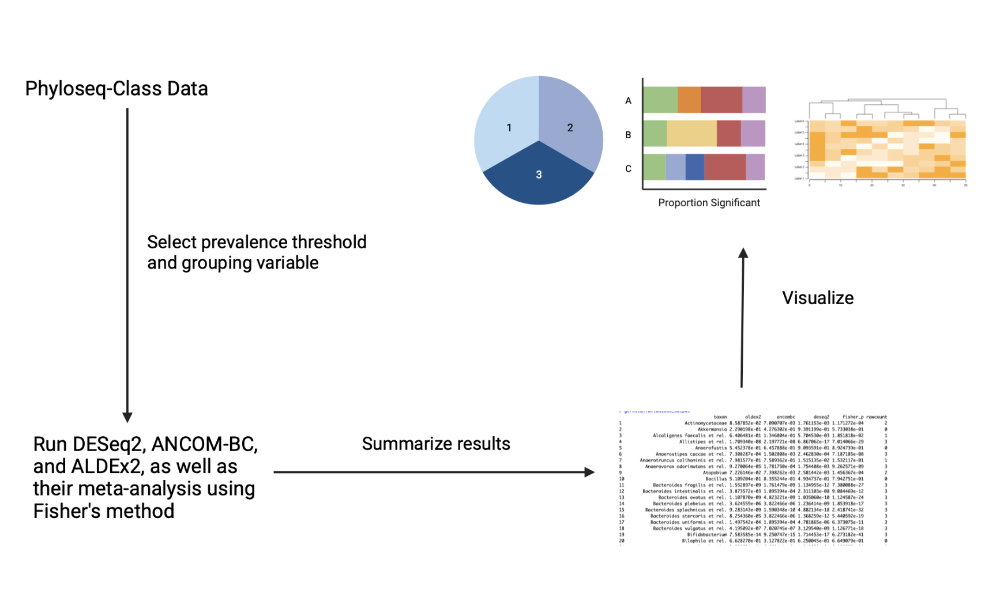

<!-- README.md is generated from README.Rmd. Please edit that file -->

```{r, include = FALSE}
knitr::opts_chunk$set(
  collapse = TRUE,
  comment = "#>",
  fig.path = "man/figures/README-",
  out.width = "100%"
)
```

# germseq

<!-- badges: start -->
<!-- badges: end -->
Compare Different Methods of Metagenomic Differential Abundance Analysis (DAA)

## Description
A healthy microbiome is an essential component of an individual's health. In fact, studies have shown a correlation between differences in microbiota composition and various diseases (Vijay and Valdes 2022). As a result, it is not difficult to understand the need for software tools to understand how the microbiome changes between conditions. This has, however, proven to be a difficult task (Weiss et al. 2017), resulting in the development of several packages in order to facilitate metagenomic differential abundance analysis (DAA). However, a recent study has found that the results of these methods have been very inconsistent and the performance of each method varies with each dataset (Nearing et al. 2022), suggesting that a consensus approach might be taken before a robust method is found. Thus, this becomes a exhaustive task, especially when multiple conditions are to be tested.   

germseq is a package that implements this suggestion by taking three commonly used methods of DAA (DESeq2, ANCOM-BC, ALDEx2) and streamlining the analysis process by executing and comparing the results of these methods. Further, it uses Fisher's method in order to perform the meta-analysis of these three methods in order to obtain a combined p-value. Through its analysis and visualization functions, individuals are therefore able to quickly evaluate the sensitivity and robustness of each method, as well as using the results of all three methods in order to determine significance. 

The germseq package was developed using R version 4.0.5 (2021-03-31), Platform: x86_64-pc-linux-gnu (64-bit) and Running under: Ubuntu 20.04.5 LTS.

## Installation

To install the latest version of the package:

``` r
require("devtools")
devtools::install_github("karenliu5/germseq", build_vignettes = TRUE)
library("germseq")
```

To run the Shiny package:
```{r}
runGermSeq()
```

## Overview
``` r
ls("package:germseq")
data(package = "germseq")
```

germseq provides three functions to evaluate the performance of DESeq2, ANCOM-BC, and ALDEx2:

* The `compare_DAA_methods` functions will run all three methods on the user-provided data, allowing the user to specify the grouping variable and the prevalence threshold. It will then output a table summarizing the results of the three methods, as well as the results of Fisher's meta-analysis. 
* The `visualize_performances` function takes in the results `compare_DAA_methods` and outputs an interactive stacked barchart indicating the proportion of taxon found significantly different between conditions by each method.
* The `visualize_overlap` function takes in the results `compare_DAA_methods` and outputs an interactive pie chart indicating the proportion of taxon identified to be significantly different by no methods, one method, two methods, and three methods respectively. 
* The `plot_result_heatmap` function takes in the results of `compare_DAA_methods` and outputs a heatmap of the -log10(p) values that result from all three methods of analysis and Fisher's meta-analysis.



For a tutorial of the package, please refer to the following vignette:

``` r
browseVignettes("germseq")
```

## Contributions
The author of this package is Karen Liu. The `compare_DAA_methods` functions use differential abundance analysis functions form `DESeq2`, `ANCOM-BC`, and `ALDEx2`, uses the `microbiome` package to calculate the prevalences, and uses functions from the `phyloseq` package to manipulate the data. Further, the `metap` package is used in order to perform the Fisher's meta-analysis. The filtering of the taxon by the prevalence threshold and combining of the results into a data frame is implemented by the author. The idea to use Fisher's method to combine the results of the three methods of DAA is by the author. The `visualize_performances`, `plot_result_heatmap` and `visualize_overlap` functions are all implemented using the `ggplot2` and `plotly` packages. 

## References
Gloor, G., Fernandes, A., Macklaim, J., Albert, A., Links, M., Quinn, T., Wu, J.R.,
Wong, R.G., and B. Lieng (2013). ALDEx2: Analysis Of Differential Abundance Taking
Sample Variation Into Account. R package version 1.30.0.
[https://bioconductor.org/packages/release/bioc/html/ALDEx2.html](https://bioconductor.org/packages/release/bioc/html/ALDEx2.html).

Huang, L. (2020). ANCOMBC: Microbiome differential abudance and correlation
analyses with bias correction. R package version 2.0.1.
[https://www.bioconductor.org/packages/release/bioc/html/ANCOMBC.html](https://bioconductor.org/packages/release/bioc/html/ALDEx2.html).

Lahti, L. and S. Shetty (2019). microbiome: Microbiome Analytics. R package version
1.20.0. [https://www.bioconductor.org/packages/release/bioc/html/microbiome.html](https://www.bioconductor.org/packages/release/bioc/html/microbiome.html).

Lahti, L., Shetty, S., Ernst, F.M. et al. (2021). Orchestrating Microbiome Analysis
with Bioconductor. [microbiome.github.io/oma/](microbiome.github.io/oma/).

Love, M., Huber, W., and S. Anders (2014). DESeq2: Differential gene expression
analysis based on the negative binomial distribution. R package version 1.38.0.
[https://bioconductor.org/packages/release/bioc/html/DESeq2.html](https://bioconductor.org/packages/release/bioc/html/DESeq2.html).

McMurdle, P.J. and S. Holmes (2013). phyloseq: Handling and analysis of high-throughput
microbiome census data. R package version 1.42.0.
[https://www.bioconductor.org/packages/release/bioc/html/phyloseq.html](https://www.bioconductor.org/packages/release/bioc/html/phyloseq.html).

Nearing, J.T., Douglas, G.M., Hayes, M.G., et al. (2022). Microbiome differential abundance methods produce different results across 38 datasets. *Nature Comm* 13(342). doi:[https://doi.org/10.1038/s41467-022-28034-z](https://doi.org/10.1038/s41467-022-28034-z). 

Olberding, N. (2019). Introduction to the Statistical Analysis of Microbiome Data in R.
[https://www.nicholas-ollberding.com/post/introduction-to-the-statistical-analysis-of-microbiome-data-in-r/](https://www.nicholas-ollberding.com/post/introduction-to-the-statistical-analysis-of-microbiome-data-in-r/).

R Core Team (2022). R: A language and environment for statistical computing. R Foundation for Statistical Computing, Vienna, Austria. [https://www.R-project.org/](https://www.R-project.org/)

Vijay, A. and A.M. Valdes (2022). Role of the gut microbiome in chronic diseases: a narrative review. *Eur J Clin Nutr* 76: 489-501. [https://doi.org/10.1038/s41430-021-00991-6](https://doi.org/10.1038/s41430-021-00991-6).

Wickham, H. and Bryan, J. (2019). R Packages (2nd edition). Newton, Massachusetts: O’Reilly Media. [https://r-pkgs.org/](https://r-pkgs.org/)

## Acknowledgements
This package was developed as part of an assessment for 2022 BCB410H: Applied Bioinformat-
ics course at the University of Toronto, Toronto, CANADA. <PackageName> welcomes issues,
enhancement requests, and other contributions. To submit an issue, use the GitHub issues.

